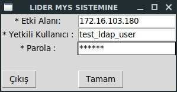
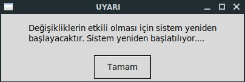

**Lider-Ahenk Repo Defining**

The Ahenk package is available at "repo.liderahenk.org". On Pardus computers, this address is defined and the Ahenk package
can be downloaded from the repository. In the terminal (console) to define this repository to your system;

    sudo wget http://repo.liderahenk.org/liderahenk-archive-keyring.asc && sudo apt-key add liderahenk-archive-keyring.asc &&  rm liderahenk-archive-keyring.asc
    
The "liderahenk-archive-keyring.asc" key file should be downloaded and installed on the system with the commands. Next;

    sudo printf  "deb [arch=amd64] http://repo.liderahenk.org/liderahenk stable main" | sudo tee -a /etc/apt/sources.list
    
The repository address is added to the "/etc/apt/sources.list" file with the command.

**Ahenk Installation**

After the repo definition process, the following operations are applied respectively.

Firstly ;

    sudo apt update
    
The current package list should be obtained with the command.

    sudo apt install ahenk
    
The current Ahenk version is downloaded with the command.    

**Ahenk Register**

After the Ahenk is downloaded;
    
    sudo ahenk-register

Ahenk is activated with the command.

Click the Yes button in the window that opens and the installation continues.

After the necessary information is entered, the installation starts by clicking the OK button.

After the installation is completed, continue by clicking the OK button in the window that opens.

Installation completed successfully. After clicking the OK button, the computer restarts.
The computer has been taken to the domain.<link href=/lider2.0/assets/style.css rel=stylesheet></link>
