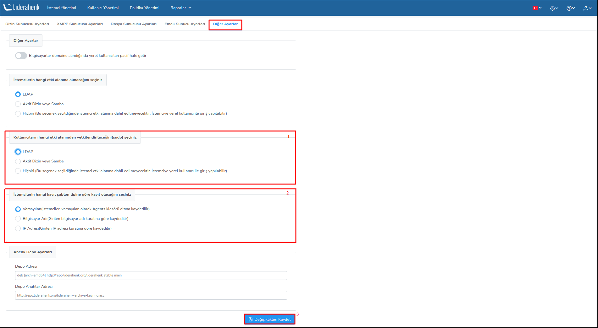

<link href=/lider3.0/assets/style.css rel=stylesheet></link>
Updating from Lider v2 to Lider v3

The following commands are run respectively on the Lider v2 server;

`
wget https://liderahenk.org/downloads/liderahenk_v2_to_v3.sh
`

`
chmod +x liderahenk_v2_to_v3.sh
`

Before executing the following command, the Lider Server IP address is given as a parameter ($lider_server_ip_address).

`
sudo /bin/bash liderahenk_v2_to_v3.sh $lider_server_ip_address
`

Eg: ** sudo /bin/bash liderahenk_v2_to_v3.sh 192.168.x.x **

By typing ** $lider_server_ip_address:8080 ** in the internet browser, Liderahenk Central Management System application is opened and the following settings are applied respectively.

1) Liderahenk Central Management System application is entered by entering Lider Interface user name and password.

2) The Server Settings page opened by clicking on the Settings button.

3) By clicking on the Other Settings tab, the changes are saved by selecting ** from which domain the users will be authorized (sudo) ** and ** according to which registration template type the clients will register ** settings according to the authorization and registration template policies in Lider v2.0 version.

